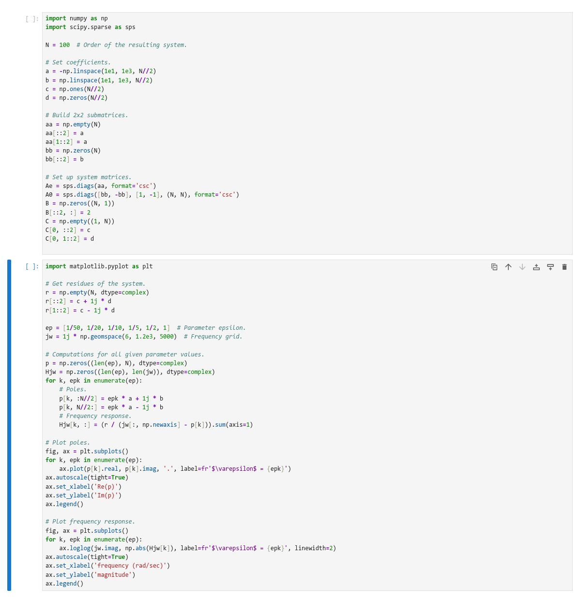
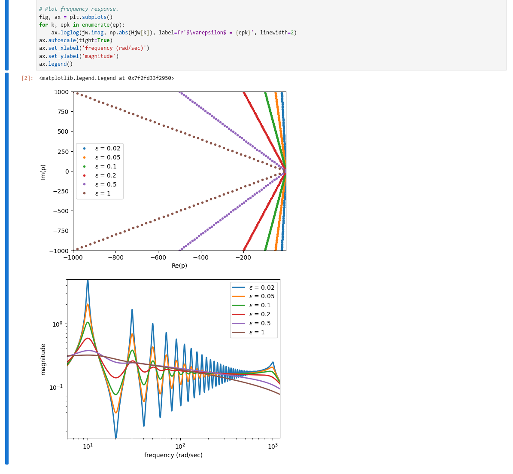

In this guide, we will explore how to build a MaPS runtime by detailing step by
step instructions to build a runtime for the benchmark [Synthetic parametric
model - MOR
Wiki](https://modelreduction.org/morwiki/Synthetic_parametric_model). If you
follow this guide exactly, as the end result, you should have a runtime
identical in all but name to
`org.modelreductino.synthetic-parametric-mode/x86_64/3984`.

## Install MaPS

As a first step, make sure you have a working install of MaPS. Follow the steps
on [the installation page](/maps/docs/guides/installation/) to install MaPS.

You can check that MaPS is in a working condition by listing all available
runtimes :

```bash
$ maps --list
Available runtimes are :
Official
        - 2023-12-07  base/x86_64/debian
        - 2024-11-18  github.anantharaman.vibrant/x86_64/1.2.1
...
```

## Initialize a sandbox

While a runtime is being built, we call it a _sandbox_, to emphasize its mutable
nature. A sandbox is a directory which contains everything required to run your
software. Not just the direct dependencies (e.g. `scipy`), but also indirect
dependency and library (e.g. `bash`, `gcc`). To make the process of populating
all dependencies easy, MaPS allows generating a starting point based on the
Debian minimal image. Initialize a new directory with this Debian minimal image:

```bash
$ maps package --init benchmark-sandbox
```

## Enter interactive sandbox

Once you have a sandbox in place, you can enter it in interactive mode. This is
almost as if you SSH into a fresh install of Debian Linux. There are the basic
utilities available, and you can handcraft your environment exactly as your
software needs.

```bash
$ maps package --sandbox bencmhark-sandbox
```

You can check that you are now in the sandbox if your input prompt has changed
to `root@runtime`. Note that even though it appears that you are root in the
sandbox, you are not really root outside the sandbox, and in particular, you
don't need `sudo` permissions. In fact, the sandbox comes with strong
compartmentalization: things you do in the sandbox will not affect your computer
outside of the sandbox.

### Setting up your environment

Now that we have an interactive prompt in the sandbox, let us install the
required environment for the benchmark.

We need `python`, `pip`, `scipy`, `matplotlib`, and optionally `jupyter`, to
make viewing the resulting figures simple. We should also update the software
in the sandbox before we install the pre requisites specific to our program.

```bash
root@runtime:~# export FAKEROOTDONTTRYCHOWN=1
root@runtime:~# fakeroot apt update
root@runtime:~# fakeroot apt full-upgrade
root@runtime:~# fakeroot apt install nano python3 python3-pip
root@runtime:~# pip install scipy matplotlib jupyter --break-my-system
```

-------------------
> Please see the [fakeroot
> section](../../reference/package-mode/#a-note-on-fakeroot) of the
> documentation for discussion of why we need the fakeroot workaround for some
> tasks
-------------------
> In newer versions of `pip`, the option `--break-my-system` is necessary
> because `pip` tries to protect you from generating universal conflicts with
> your system's package manager. As the runtime is a single self contained
> archive which does not expect to receive changes or updates, this does not
> pose a problem for us in this particular use case, and the option is safe to
> use.
-------------------

### Using jupyter to include data files

With our environment set up, we are ready to start including data files into the
sandbox. This data could be anything which complements the software you are
trying to package: the source files, compiled binaries, input data, accompanying
metadata.

For our benchmark, this means to include the input script.

Run jupyter:

```bash
root@runtime:~# jupyter notebook --allow-root
```

This will launch the jupyter server in the sandbox. As we have not installed a
browser in the sandbox, a browser will not be auto launched with the command.
But, the output will include a line like

`http://localhost:8888/tree?token=371f262927eafb0236f242976a146f93b228e9b52b5fb36d`

which you can copy-paste into your regular browser to open the jupyter notebook
interface.

Using the newly opened jupyter interface, make a file called `Benchmark.ipynb`,
and put in the input script. You can also optionally execute the the files so
that the output is saved in the file, for your users to view without needing to
rerun.

Your jupyter notebook should look something like this:



If you chose to run the script (like the official runtime), then they will also
include the output:



Once you are happy with how the file looks, quit the jupyter server by hitting
CTRL+C in the terminal window. After exiting jupyter, you should be greeted
by the runtime prompt again.

-------------------
> We need `--allow-root` in `jupyter` for similar reasons as `--break-my-system`
> in `pip`. These applications try to protect you from the bad practice of
> running these tools as root. But since we are in a runtime, and we only appear
> as root without having any of the super powers, this is acceptable.
-------------------

### Manifest File

We are now ready to add the final polish to the sandbox before publishing!

The sandbox should include a `manifest.toml` file in its root directory. This
file includes arbitrary metadata associated with the final runtime, and also,
critically, the command to execute for the user when starting the runtime. This
allows, for example, to execute jupyter notebook directly when a user tries to
execute a runtime, instead of including the command in instructions.

Create a manifest file in the sandbox:

```bash
root@runtime:~# nano /manifest.toml
```

Copy and paste the following snippet into the manifest file, and then save.

```toml
[Core]
command = "python3 -m jupyter notebook --allow-root"

[Meta]
URL = "https://modelreduction.org/morwiki/Synthetic_parametric_model"
Type = "Benchmark"
Title = "Synthetic parametric model"
```

You can now exit the sandbox by typing `exit`. This will return you to your
normal system prompt.

## Commit your runtime

You can now commit your runtime! This is akin to taking a snapshot of the
current state of your sandbox, and preserving it. You need to provide a name to
this snapshot. The recommended standard for this is a reverse DNS format,
followed by the architecture and version. The official repository for MaPS
runtimes enforces this naming scheme. An example name in the correct format is
`me.myname.my-awesome-software/x86_64/v1.0`

Commit your sandbox into a runtime :

```bash
$ maps package --commit benchmark-sandbox "my.myname/my-awesome-softare/x86_64/v1.0"
```

### Publishing on Official repository

You can publish your runtimes on the Official MaPS software repository. To do
this, you will require an authentication string, with a limited time validity.
This is to try to combat spam. Please [contact
us](mailto:akaushik@mathematik.uni-kl.de) with some information about who you
are and what software you want to upload, and we will provide you this
authentication string. Once you have it, you need to provide it to MaPS as an
environment variable, and MaPS will upload your software to our servers. After a
manual review, making sure everything is in order, we will make your software
available on the Official repository.

Assuming the authentication string you got from us is
`myname:51afb317-b7f3-4203-b11d-63fea0d65b85`, to upload your runtime :

```bash
$ export MTDAUTH="myname:51afb317-b7f3-4203-b11d-63fea0d65b85"
$ maps package --upload "my.myname/my-awesome-softare/x86_64/v1.0"
```
